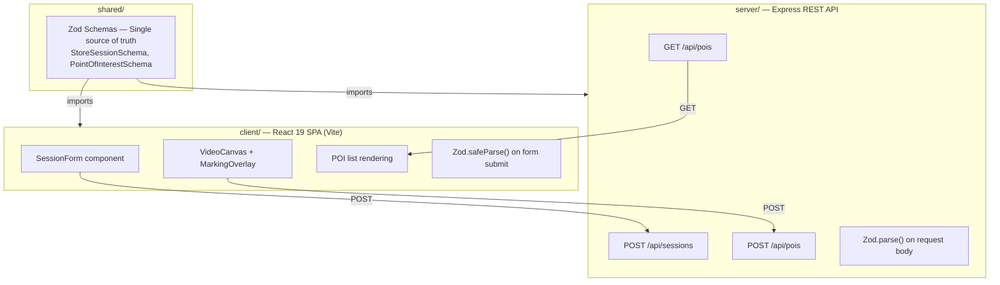
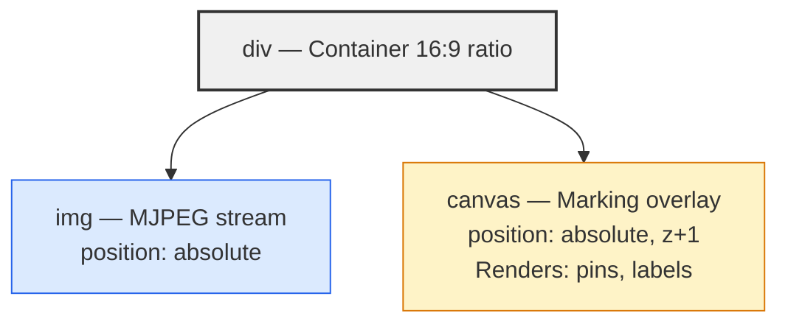
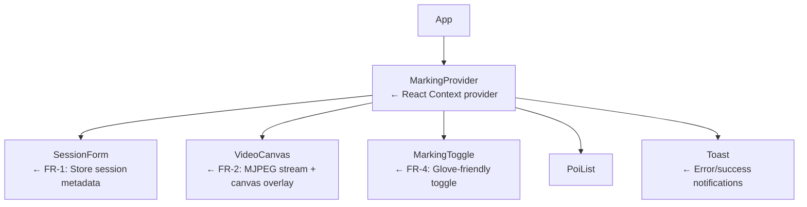

# Spec 01: Vision AI Placement Marker

> **Status:** Draft → Ready for Implementation  
> **Author:** Engineering Lead / Architect  
> **Last Updated:** 2026-03-24  
> **Depends On:** Skeleton scaffold (shared, server, client workspaces)

---

## 📝 Context

This feature is part of the **Installer Toolset**. Installers use this to calibrate the physical store layout by marking "Detection Points" (e.g., POS, Entry, Exit) directly on a live video feed from the Vision AI camera.

## 👤 User Story (Refined from Jira)

**As an** Installer,  
**I want to** tap a specific location on the live video stream,  
**So that** I can register a "Detection Point" with precise normalized coordinates and GPS metadata.

### Acceptance Criteria

| # | Criteria | Verification |
|---|----------|-------------|
| AC-1 | Video stream renders in 16:9 aspect ratio on mobile and desktop | Visual + unit test |
| AC-2 | Tapping the canvas in "Marking Mode" creates a pin at the correct normalized position | Unit test |
| AC-3 | Pins persist in local state and render as red circles on the canvas | Unit test |
| AC-4 | Session form validates `storeId`, `installerId`, and `cameraSlot` with Zod | Unit test + API test |
| AC-5 | POI data is sent to the Express API and validated server-side with the same Zod schema | API test |
| AC-6 | If the server is unreachable, POIs queue in LocalStorage and sync when reconnected | Unit test |
| AC-7 | All interactive elements have a minimum 48x48px hit target | Visual |

---

## 🏗️ Architecture & Design Patterns

### Pattern: Decoupled Full-Stack with Shared Validation



### Design Patterns Used

| Pattern | Where | Why |
|---------|-------|-----|
| **Strategy Pattern** | `CoordinateMapper` | Encapsulates the normalized coordinate calculation so it can be unit tested independently of the DOM |
| **Observer Pattern** | `useMarkingStore` (React Context) | Components subscribe to marking state changes without prop drilling |
| **Offline Queue Pattern** | `OfflineQueue` service | Decouples network state from user interaction; queues failed requests in LocalStorage |
| **Proxy Pattern** | Server → Hardware | Express acts as a proxy to the VisionAI hardware; frontend never calls hardware directly |
| **Validation Gateway** | Zod schemas in `shared/` | Single schema validates on both client (early feedback) and server (enforcement) |

---

## 📐 Data Schemas (Shared — `shared/src/schemas.ts`)

### StoreSession

```typescript
// Zod Schema
export const StoreSessionSchema = z.object({
  storeId: z.string().regex(/^[A-Z]{2}-\d{3}$/, "Must follow pattern [AA]-[000]"),
  installerId: z.string().min(5, "Must be at least 5 characters"),
  cameraSlot: z.number().int().min(1).max(16),
  environment: z.literal("Drive-Thru"),
  timestamp: z.string().datetime(),
});

// Inferred TypeScript type
export type StoreSession = z.infer<typeof StoreSessionSchema>;
```

### PointOfInterest

```typescript
export const PointOfInterestSchema = z.object({
  id: z.string().uuid(),
  x: z.number().min(0).max(1),       // Normalized: 0.0 – 1.0
  y: z.number().min(0).max(1),       // Normalized: 0.0 – 1.0
  timestamp: z.string().datetime(),   // ISO 8601
  location: z.object({
    lat: z.number().min(-90).max(90),
    lng: z.number().min(-180).max(180),
  }),
});

export type PointOfInterest = z.infer<typeof PointOfInterestSchema>;
```

### Validation Rules Summary

| Field | Rule | Error Message |
|-------|------|---------------|
| `storeId` | Regex `^[A-Z]{2}-\d{3}$` | "Must follow pattern [AA]-[000]" |
| `installerId` | Min length 5 | "Must be at least 5 characters" |
| `cameraSlot` | Integer, 1–16 | "Must be between 1 and 16" |
| `x`, `y` | Float, 0.0–1.0 | "Must be between 0 and 1" |
| `location.lat` | Float, -90–90 | "Invalid latitude" |
| `location.lng` | Float, -180–180 | "Invalid longitude" |

---

## 🛠️ Functional Requirements

### FR-1: Store Session Form

**Component:** `client/src/components/SessionForm.tsx`

The installer must enter session metadata before marking begins.

| Field | Input Type | Placeholder | Validation |
|-------|-----------|-------------|------------|
| Store ID | Text | `"NY-102"` | `StoreSessionSchema.storeId` |
| Installer ID | Text | `"INST-12345"` | `StoreSessionSchema.installerId` |
| Camera Slot | Number stepper | `1` | `StoreSessionSchema.cameraSlot` |
| Environment | Disabled/pre-filled | `"Drive-Thru"` | Literal |

**Behavior:**
- On valid submit → save session to React Context + POST to `/api/sessions`
- On invalid → display inline Zod error messages under each field
- On network failure → queue in LocalStorage, show orange "Offline" toast

**Methods:**

```typescript
// Hook: useSessionForm()
function useSessionForm(): {
  formData: Partial<StoreSession>;
  errors: Record<string, string>;          // field-level Zod errors
  handleChange: (field: string, value: string | number) => void;
  handleSubmit: () => Promise<boolean>;    // true if saved successfully
  isSubmitting: boolean;
}
```

---

### FR-2: Interactive Video Canvas

**Component:** `client/src/components/VideoCanvas.tsx`

Displays the live MJPEG stream with an interactive overlay.

**Architecture:**



**Props:**

```typescript
interface VideoCanvasProps {
  streamUrl: string;             // MJPEG endpoint (proxied via server)
  pois: PointOfInterest[];       // Currently marked points to render
  isMarkingMode: boolean;        // Whether clicks should register
  onMark: (poi: PointOfInterest) => void;  // Callback when user taps
}
```

**Aspect Ratio:** Maintained via CSS `aspect-ratio: 16/9` with `object-fit: contain`.

**Stream Note:** For demo purposes, use a static placeholder image (`/public/demo-camera-feed.jpg`). In production, the `streamUrl` would point to `/api/stream/:cameraSlot` which the server proxies from the VisionAI hardware.

---

### FR-3: Coordinate Mapping (Strategy Pattern)

**Utility:** `client/src/lib/coordinateMapper.ts`

Encapsulates the normalized coordinate calculation as a pure function.

```typescript
/**
 * Converts a click event's pixel position to normalized coordinates (0.0–1.0)
 * relative to the target element's bounding box.
 *
 * @param clientX - The click's clientX from the MouseEvent or Touch
 * @param clientY - The click's clientY from the MouseEvent or Touch
 * @param rect    - The element's DOMRect (from getBoundingClientRect())
 * @returns { x: number, y: number } — normalized coordinates clamped to [0, 1]
 */
export function toNormalizedCoords(
  clientX: number,
  clientY: number,
  rect: DOMRect
): { x: number; y: number } {
  const x = Math.max(0, Math.min(1, (clientX - rect.left) / rect.width));
  const y = Math.max(0, Math.min(1, (clientY - rect.top) / rect.height));
  return { x, y };
}

/**
 * Converts normalized coordinates back to pixel positions
 * for rendering pins on the canvas.
 */
export function toPixelCoords(
  normX: number,
  normY: number,
  rect: DOMRect
): { px: number; py: number } {
  return {
    px: normX * rect.width,
    py: normY * rect.height,
  };
}
```

---

### FR-4: Marking Mode Toggle

**Component:** `client/src/components/MarkingToggle.tsx`

A large, glove-friendly toggle button.

**Design Requirements:**
- Minimum size: `64x64px` (exceeds 48px minimum for extra safety)
- Active state: `#39FF14` (Neon Green) background with "MARKING ON" text
- Inactive state: `#6B7280` (Gray) background with "MARKING OFF" text
- Icon: `Crosshair` from Lucide React

**Methods:**

```typescript
interface MarkingToggleProps {
  isActive: boolean;
  onToggle: () => void;
}
```

---

### FR-5: POI Pin Rendering on Canvas

**Utility:** `client/src/lib/pinRenderer.ts`

Draws POI pins on the HTML5 Canvas overlay.

```typescript
/**
 * Renders all POI pins on the canvas.
 * Called on every state change or window resize.
 *
 * @param ctx   - The Canvas 2D rendering context
 * @param pois  - Array of PointOfInterest objects
 * @param rect  - The canvas element's DOMRect
 */
export function renderPins(
  ctx: CanvasRenderingContext2D,
  pois: PointOfInterest[],
  rect: DOMRect
): void;
```

**Pin Visual:**
- Circle: 12px radius, `#FF0000` (Safety Red) fill, 2px white border
- Label: POI index number (1, 2, 3...) centered inside the circle, white, 14px bold

---

### FR-6: Marking State Management (Observer Pattern)

**Context:** `client/src/context/MarkingContext.tsx`

```typescript
interface MarkingState {
  session: StoreSession | null;
  pois: PointOfInterest[];
  isMarkingMode: boolean;
  isOnline: boolean;
}

interface MarkingActions {
  setSession: (session: StoreSession) => void;
  addPoi: (poi: PointOfInterest) => void;
  removePoi: (id: string) => void;
  toggleMarkingMode: () => void;
  syncOfflineQueue: () => Promise<void>;
}

// Exported hook
export function useMarking(): MarkingState & MarkingActions;
```

**Persistence:** All state changes are mirrored to `localStorage` under the key `vision-ai-session`. On app load, hydrate from `localStorage` if available.

---

### FR-7: Offline Queue (Offline Queue Pattern)

**Service:** `client/src/lib/offlineQueue.ts`

```typescript
interface QueuedRequest {
  id: string;
  endpoint: string;        // e.g., "/api/pois"
  method: "POST";
  body: unknown;
  createdAt: string;       // ISO 8601
  retries: number;
}

/**
 * Adds a failed request to the offline queue in LocalStorage.
 */
export function enqueue(request: Omit<QueuedRequest, "id" | "createdAt" | "retries">): void;

/**
 * Attempts to replay all queued requests. Removes successful ones.
 * Called when navigator.onLine transitions to true.
 */
export function flushQueue(): Promise<{ succeeded: number; failed: number }>;

/**
 * Returns the current queue length (for UI badge display).
 */
export function getQueueLength(): number;
```

**LocalStorage Key:** `vision-ai-offline-queue`

---

## 🔌 API Contract (Server — `server/src/routes/`)

### POST `/api/sessions`

Creates a new installer session.

| | Detail |
|---|---|
| **Request Body** | `StoreSession` (validated by `StoreSessionSchema.parse()`) |
| **Success** | `201 Created` — returns the saved session object |
| **Validation Error** | `400 Bad Request` — `{ error: "VALIDATION_ERROR", message: "...", statusCode: 400 }` |
| **Server Error** | `500 Internal Server Error` — `{ error: "INTERNAL_ERROR", message: "...", statusCode: 500 }` |

### POST `/api/pois`

Registers a new Point of Interest.

| | Detail |
|---|---|
| **Request Body** | `PointOfInterest` (validated by `PointOfInterestSchema.parse()`) |
| **Success** | `201 Created` — returns the saved POI object |
| **Validation Error** | `400 Bad Request` — same error format |
| **Server Error** | `500 Internal Server Error` — same error format |

### GET `/api/pois`

Returns all POIs for the current session.

| | Detail |
|---|---|
| **Success** | `200 OK` — `PointOfInterest[]` |

### GET `/api/health`

Health check endpoint.

| | Detail |
|---|---|
| **Success** | `200 OK` — `{ status: "ok", timestamp: "..." }` |

---

## 🧩 Component Tree



---

## 📁 File Structure (Expected Output)

```
client/src/
├── components/
│   ├── SessionForm.tsx          ← FR-1
│   ├── VideoCanvas.tsx          ← FR-2
│   ├── MarkingToggle.tsx        ← FR-4
│   ├── PoiList.tsx              ← POI list display
│   └── Toast.tsx                ← Notification component
├── context/
│   └── MarkingContext.tsx       ← FR-6
├── lib/
│   ├── coordinateMapper.ts     ← FR-3 (pure functions)
│   ├── pinRenderer.ts          ← FR-5 (canvas drawing)
│   ├── offlineQueue.ts         ← FR-7 (LocalStorage queue)
│   └── api.ts                  ← Fetch wrapper with error handling
├── hooks/
│   └── useSessionForm.ts       ← FR-1 form logic
├── App.tsx                      ← Updated with component tree
└── main.tsx

server/src/
├── routes/
│   ├── session.ts               ← Already exists (POST/GET /api/sessions)
│   └── poi.ts                   ← Already exists (POST/GET /api/pois)
├── app.ts                       ← Already exists
└── index.ts                     ← Already exists
```

---

## 🧪 Test Specifications

### Testing Stack
- **Client:** Vitest + React Testing Library + jsdom
- **Server:** Vitest + Supertest
- **Shared:** Vitest (pure schema tests)

---

### Test Suite 1: Shared Schema Validation (`shared/src/__tests__/schemas.test.ts`)

Tests the Zod schemas that are the single source of truth.

| # | Test Case | Input | Expected |
|---|-----------|-------|----------|
| S-1 | Valid StoreSession passes | `{ storeId: "NY-102", installerId: "INST-12345", cameraSlot: 1, environment: "Drive-Thru", timestamp: "2026-03-24T10:00:00Z" }` | Parse succeeds |
| S-2 | Invalid storeId pattern rejects | `{ storeId: "ny102", ... }` | ZodError with "Must follow pattern" |
| S-3 | storeId with lowercase rejects | `{ storeId: "ny-102", ... }` | ZodError |
| S-4 | installerId too short rejects | `{ installerId: "AB", ... }` | ZodError with "at least 5" |
| S-5 | cameraSlot 0 rejects | `{ cameraSlot: 0, ... }` | ZodError with "between 1 and 16" |
| S-6 | cameraSlot 17 rejects | `{ cameraSlot: 17, ... }` | ZodError |
| S-7 | cameraSlot float rejects | `{ cameraSlot: 1.5, ... }` | ZodError (not integer) |
| S-8 | Valid POI passes | `{ id: "uuid", x: 0.5, y: 0.5, ... }` | Parse succeeds |
| S-9 | POI x out of range rejects | `{ x: 1.1, ... }` | ZodError |
| S-10 | POI negative x rejects | `{ x: -0.1, ... }` | ZodError |
| S-11 | POI lat out of range rejects | `{ location: { lat: 91, lng: 0 } }` | ZodError |
| S-12 | POI invalid UUID rejects | `{ id: "not-a-uuid", ... }` | ZodError |

---

### Test Suite 2: Coordinate Mapper (`client/src/lib/__tests__/coordinateMapper.test.ts`)

Pure function tests — no DOM required.

| # | Test Case | Input | Expected |
|---|-----------|-------|----------|
| C-1 | Center click returns (0.5, 0.5) | `clientX: 500, clientY: 250, rect: { left: 0, top: 0, width: 1000, height: 500 }` | `{ x: 0.5, y: 0.5 }` |
| C-2 | Top-left corner returns (0, 0) | `clientX: 0, clientY: 0, rect: { left: 0, top: 0, width: 1000, height: 500 }` | `{ x: 0, y: 0 }` |
| C-3 | Bottom-right corner returns (1, 1) | `clientX: 1000, clientY: 500, rect: same` | `{ x: 1, y: 1 }` |
| C-4 | Click outside element clamps to 0 | `clientX: -50, clientY: -50, rect: same` | `{ x: 0, y: 0 }` |
| C-5 | Click beyond element clamps to 1 | `clientX: 1200, clientY: 600, rect: same` | `{ x: 1, y: 1 }` |
| C-6 | Offset element calculates correctly | `clientX: 150, clientY: 75, rect: { left: 100, top: 50, width: 200, height: 100 }` | `{ x: 0.25, y: 0.25 }` |
| C-7 | toPixelCoords roundtrips correctly | `normX: 0.5, normY: 0.5, rect: { width: 800, height: 450 }` | `{ px: 400, py: 225 }` |

---

### Test Suite 3: Offline Queue (`client/src/lib/__tests__/offlineQueue.test.ts`)

Uses a mocked `localStorage`.

| # | Test Case | Action | Expected |
|---|-----------|--------|----------|
| Q-1 | Enqueue adds item to storage | `enqueue({ endpoint: "/api/pois", method: "POST", body: {...} })` | `getQueueLength() === 1` |
| Q-2 | Enqueue multiple items | Enqueue 3 items | `getQueueLength() === 3` |
| Q-3 | Flush succeeds removes items | Mock fetch success → `flushQueue()` | `getQueueLength() === 0`, result: `{ succeeded: 3, failed: 0 }` |
| Q-4 | Flush with network error retains items | Mock fetch failure → `flushQueue()` | `getQueueLength() === 3`, result: `{ succeeded: 0, failed: 3 }` |
| Q-5 | Partial flush keeps failed items | 2 succeed, 1 fails | `getQueueLength() === 1` |
| Q-6 | Empty queue returns zero | `flushQueue()` on empty | `{ succeeded: 0, failed: 0 }` |

---

### Test Suite 4: Session Form Component (`client/src/components/__tests__/SessionForm.test.tsx`)

Uses React Testing Library.

| # | Test Case | Action | Expected |
|---|-----------|--------|----------|
| F-1 | Renders all form fields | Render `<SessionForm />` | 3 inputs + submit button visible |
| F-2 | Submit with valid data calls API | Fill valid data → click Submit | `handleSubmit` called with valid `StoreSession` |
| F-3 | Invalid storeId shows error | Enter "abc" → submit | Error text "Must follow pattern" visible |
| F-4 | Empty installerId shows error | Leave blank → submit | Error text "at least 5 characters" visible |
| F-5 | Camera slot out of range shows error | Enter 20 → submit | Error text "between 1 and 16" visible |
| F-6 | Submit button shows loading state | Click submit while pending | Button disabled + spinner visible |
| F-7 | All inputs meet 48px min height | Render form | Each input `offsetHeight >= 48` |

---

### Test Suite 5: Video Canvas Component (`client/src/components/__tests__/VideoCanvas.test.tsx`)

| # | Test Case | Action | Expected |
|---|-----------|--------|----------|
| V-1 | Renders image with stream URL | Render with `streamUrl` | `` in DOM |
| V-2 | Canvas overlay is present | Render component | `<canvas>` element exists |
| V-3 | Click in marking mode fires onMark | `isMarkingMode: true` → click canvas | `onMark` called with normalized coords |
| V-4 | Click outside marking mode is ignored | `isMarkingMode: false` → click canvas | `onMark` NOT called |
| V-5 | Renders correct number of pins | Pass 3 POIs | Canvas draw calls match 3 pins |

---

### Test Suite 6: API Routes — Server (`server/src/routes/__tests__/session.test.ts`)

Uses Supertest against the Express app.

| # | Test Case | Request | Expected |
|---|-----------|---------|----------|
| A-1 | Create session with valid data | `POST /api/sessions` with valid body | `201` + session object |
| A-2 | Reject invalid storeId | `POST /api/sessions { storeId: "bad" }` | `400` + error message |
| A-3 | Reject missing installerId | `POST /api/sessions` without `installerId` | `400` |
| A-4 | Reject cameraSlot out of range | `POST /api/sessions { cameraSlot: 99 }` | `400` |
| A-5 | List sessions | `GET /api/sessions` | `200` + array |

### Test Suite 7: API Routes — POI (`server/src/routes/__tests__/poi.test.ts`)

| # | Test Case | Request | Expected |
|---|-----------|---------|----------|
| P-1 | Create POI with valid data | `POST /api/pois` with valid body | `201` + POI object |
| P-2 | Reject POI with x > 1 | `POST /api/pois { x: 1.5 }` | `400` |
| P-3 | Reject POI with invalid UUID | `POST /api/pois { id: "not-uuid" }` | `400` |
| P-4 | Reject POI with lat > 90 | `POST /api/pois { location: { lat: 100 } }` | `400` |
| P-5 | List POIs | `GET /api/pois` | `200` + array |
| P-6 | Health check responds | `GET /api/health` | `200` + `{ status: "ok" }` |

---

## 🎨 UX Constraints (Mobile-First Field UX)

| Constraint | Rule | Rationale |
|------------|------|-----------|
| Min hit target | `48x48px` (toggle: `64x64px`) | Installers wear gloves |
| Pin color | `#FF0000` (Safety Red) | High contrast on any camera feed |
| Active state | `#39FF14` (Neon Green) | Visible in low-light environments |
| Offline indicator | Orange badge with queue count | Non-blocking; installer can continue working |
| Font size | Min `16px` body, `14px` labels | Readable at arm's length |
| Layout | Single column, no horizontal scrolling | One-handed mobile operation |

---

## ⚠️ Error Handling Matrix

| Scenario | Client Behavior | Server Response |
|----------|----------------|-----------------|
| Validation error on submit | Inline red error below field | `400 { error: "VALIDATION_ERROR", message: "..." }` |
| Server unreachable | Orange "Offline" toast + queue to LocalStorage | N/A |
| Server returns 500 | Red "Server Error" toast | `500 { error: "INTERNAL_ERROR" }` |
| GPS unavailable | Use `{ lat: 0, lng: 0 }` as fallback, show warning | N/A |
| Canvas not supported | Show static image without overlay + warning message | N/A |

---

## 📋 Implementation Checklist

- [ ] **Shared:** Schemas already exist — verify they match this spec
- [ ] **Server:** Routes already exist — add test suites (Suite 6, 7)
- [ ] **Client:** Create `MarkingContext` (FR-6)
- [ ] **Client:** Create `coordinateMapper.ts` (FR-3) + tests (Suite 2)
- [ ] **Client:** Create `offlineQueue.ts` (FR-7) + tests (Suite 3)
- [ ] **Client:** Create `pinRenderer.ts` (FR-5)
- [ ] **Client:** Create `SessionForm.tsx` (FR-1) + tests (Suite 4)
- [ ] **Client:** Create `VideoCanvas.tsx` (FR-2) + tests (Suite 5)
- [ ] **Client:** Create `MarkingToggle.tsx` (FR-4)
- [ ] **Client:** Create `PoiList.tsx` + `Toast.tsx`
- [ ] **Client:** Wire up `App.tsx` with component tree
- [ ] **Shared:** Add test suite (Suite 1)
- [ ] **All:** Run `npm run build` — zero errors
- [ ] **All:** Run `npm run test` — all tests pass