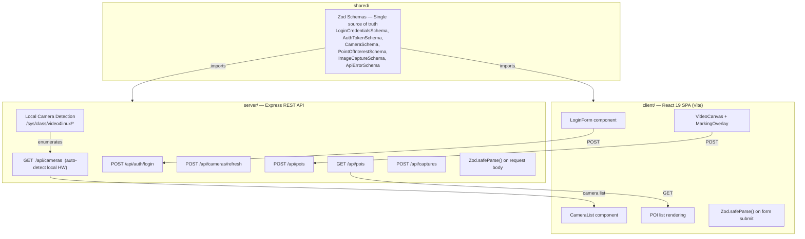
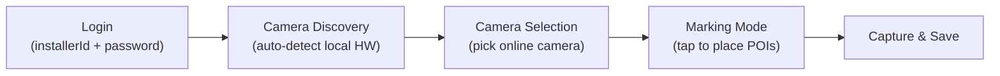
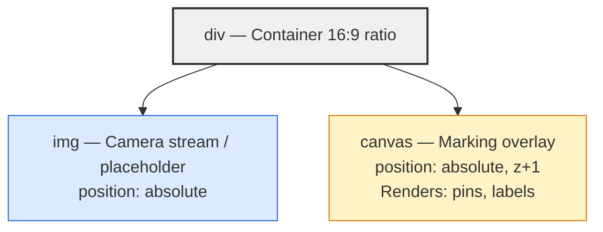
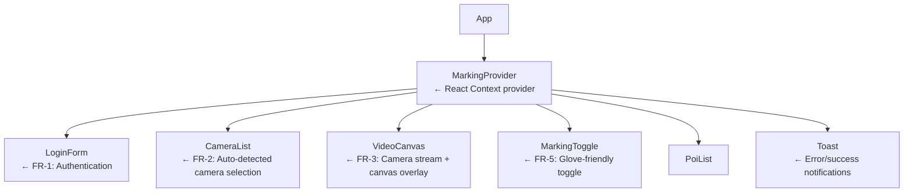

# Spec 01: Vision AI Placement Marker

> **Status:** Draft → Ready for Implementation  
> **Author:** Engineering Lead / Architect  
> **Last Updated:** 2026-03-24  
> **Depends On:** Skeleton scaffold (shared, server, client workspaces)

---

## 📝 Context

This feature is part of the **Installer Toolset**. Installers use this to calibrate the physical store layout by marking "Detection Points" (e.g., POS, Entry, Exit) directly on a live video feed from the Vision AI camera.

## 👤 User Story (Refined from Jira)

**As an** Installer,  
**I want to** log in with my installer credentials, discover cameras installed on the local hardware, and tap specific locations on the live video stream,  
**So that** I can register "Detection Points" with precise normalized coordinates and GPS metadata.

### Acceptance Criteria

| # | Criteria | Verification |
|---|----------|-------------|
| AC-1 | Installer can log in with installer ID and password | Unit test + API test |
| AC-2 | Server auto-detects cameras on the local hardware machine and presents them | API test |
| AC-3 | Video stream renders in 16:9 aspect ratio on mobile and desktop | Visual + unit test |
| AC-4 | Tapping the canvas in "Marking Mode" creates a pin at the correct normalized position | Unit test |
| AC-5 | Pins persist in local state and render as red circles on the canvas | Unit test |
| AC-6 | POI data is sent to the Express API and validated server-side with the same Zod schema | API test |
| AC-7 | If the server is unreachable, POIs queue in LocalStorage and sync when reconnected | Unit test |
| AC-8 | All interactive elements have a minimum 48x48px hit target | Visual |

---

## 🏗️ Architecture & Design Patterns

### Pattern: Decoupled Full-Stack with Shared Validation



### Application Flow



### Design Patterns Used

| Pattern | Where | Why |
|---------|-------|-----|
| **Strategy Pattern** | `CoordinateMapper` | Encapsulates the normalized coordinate calculation so it can be unit tested independently of the DOM |
| **Observer Pattern** | `useMarking` (React Context) | Components subscribe to marking state changes without prop drilling |
| **Offline Queue Pattern** | `OfflineQueue` service | Decouples network state from user interaction; queues failed requests in LocalStorage |
| **Proxy Pattern** | Server → Hardware | Express acts as a proxy to the VisionAI hardware; frontend never calls hardware directly |
| **Validation Gateway** | Zod schemas in `shared/` | Single schema validates on both client (early feedback) and server (enforcement) |
| **Hardware Abstraction** | `detectLocalCameras()` | Server reads `/sys/class/video4linux/` to auto-discover cameras; abstracts OS-specific enumeration behind a clean function |

---

## 📐 Data Schemas (Shared — `shared/src/schemas.ts`)

### LoginCredentials
Use admin as username and admin as password for the Installer

```typescript
export const LoginCredentialsSchema = z.object({
  installerId: z.string().min(5, "Must be at least 5 characters"),
  password: z.string().min(1, "Password is required"),
});

export type LoginCredentials = z.infer<typeof LoginCredentialsSchema>;
```

### AuthToken

```typescript
export const AuthTokenSchema = z.object({
  token: z.string().min(1),
  installerId: z.string(),
  deviceId: z.string(),
  expiresAt: z.string().datetime(),
});

export type AuthToken = z.infer<typeof AuthTokenSchema>;
```

### Camera

```typescript
export const CameraSchema = z.object({
  id: z.string().uuid(),
  name: z.string().min(1, "Camera name is required"),
  slot: z.number().int().min(1).max(16),
  status: z.enum(["online", "offline", "error"]),
  streamUrl: z.string().url(),
});

export type Camera = z.infer<typeof CameraSchema>;

export const CameraListSchema = z.array(CameraSchema);
```

### PointOfInterest

```typescript
export const PointOfInterestSchema = z.object({
  id: z.string().uuid(),
  cameraId: z.string().uuid(),
  x: z.number().min(0).max(1),       // Normalized: 0.0 – 1.0
  y: z.number().min(0).max(1),       // Normalized: 0.0 – 1.0
  timestamp: z.string().datetime(),   // ISO 8601
  location: z.object({
    lat: z.number().min(-90).max(90),
    lng: z.number().min(-180).max(180),
  }),
});

export type PointOfInterest = z.infer<typeof PointOfInterestSchema>;
```

### ImageCapture

```typescript
export const ImageCaptureSchema = z.object({
  id: z.string().uuid(),
  cameraId: z.string().uuid(),
  timestamp: z.string().datetime(),
  dataUrl: z.string().min(1, "Image data is required"),
  poiIds: z.array(z.string().uuid()),
});

export type ImageCapture = z.infer<typeof ImageCaptureSchema>;
```

### ApiError

```typescript
export const ApiErrorSchema = z.object({
  error: z.string(),
  message: z.string(),
  statusCode: z.number(),
});

export type ApiError = z.infer<typeof ApiErrorSchema>;
```

### Validation Rules Summary

| Field | Rule | Error Message |
|-------|------|---------------|
| `installerId` | Min length 5 | "Must be at least 5 characters" |
| `password` | Min length 1 | "Password is required" |
| `camera.name` | Min length 1 | "Camera name is required" |
| `camera.slot` | Integer, 1–16 | "Must be between 1 and 16" |
| `x`, `y` | Float, 0.0–1.0 | "Must be between 0 and 1" |
| `location.lat` | Float, -90–90 | "Invalid latitude" |
| `location.lng` | Float, -180–180 | "Invalid longitude" |

---

## 🛠️ Functional Requirements

### FR-1: Login Form

**Component:** `client/src/components/LoginForm.tsx`  
**Hook:** `client/src/hooks/useLoginForm.ts`

The installer must authenticate before accessing camera and marking features.

| Field | Input Type | Placeholder | Validation |
|-------|-----------|-------------|------------|
| Installer ID | Text | `"INST-12345"` | `LoginCredentialsSchema.installerId` |
| Password | Password | `"Enter password"` | `LoginCredentialsSchema.password` |

**Behavior:**
- On valid submit → POST to `/api/auth/login`, store token in React Context
- On invalid credentials → display "Invalid installer ID or password" toast
- On network failure → show orange "Offline" toast
- Default password: `VisionAI-Install-2026`

**Methods:**

```typescript
function useLoginForm(): {
  installerId: string;
  password: string;
  error: string;
  isSubmitting: boolean;
  setInstallerId: (v: string) => void;
  setPassword: (v: string) => void;
  handleSubmit: () => Promise<boolean>;
}
```

---

### FR-2: Camera Auto-Detection & Discovery

**Server Module:** `server/src/routes/cameras.ts`  
**Exported Function:** `detectLocalCameras()`

The server automatically detects cameras installed on the local hardware machine and presents them to the client for selection.

**Detection Strategy (Linux):**

1. Read the `/sys/class/video4linux/` directory to enumerate all video capture devices
2. For each `videoN` device, read its name from `/sys/class/video4linux/videoN/name`
3. Deduplicate by camera name (physical cameras often register multiple `/dev/video*` entries)
4. Assign sequential slot numbers starting from 1
5. All detected cameras default to `status: "online"` with a local stream URL
6. Cache results in memory — re-detect only on explicit refresh via `POST /api/cameras/refresh`

**Fallback:**
- If `/sys/class/video4linux/` does not exist (non-Linux OS), return an empty array
- If any detection error occurs, return an empty array gracefully

**Client Component:** `client/src/components/CameraList.tsx`

Fetches the auto-detected camera list from `GET /api/cameras` and displays each camera as a selectable card.

| Element | Interaction | Condition |
|---------|------------|-----------|
| Online camera card | Tap to select → advance to marking view | `status === "online"` |
| Offline camera card | Disabled, grayed out | `status === "offline"` |
| Error camera card | Disabled, red indicator | `status === "error"` |

**Camera Card UI:**
- Camera icon + name + slot number
- Status indicator (Wifi icon for online, WifiOff for offline, AlertTriangle for error)
- Minimum 48px height for glove-friendly interaction

---

### FR-3: Interactive Video Canvas

**Component:** `client/src/components/VideoCanvas.tsx`

Displays the camera stream with an interactive overlay.

**Architecture:**



**Props (via Context):**
- `selectedCamera` — The camera to display the stream from
- `pois` — Currently marked points to render
- `isMarkingMode` — Whether clicks should register
- `addPoi` — Callback when user taps

**Aspect Ratio:** Maintained via CSS `aspect-ratio: 16/9` with `object-fit: contain`.

**Stream Note:** For demo purposes, place any `.mp4` file in `client/public/input/` and render it via a `<video>` element with `autoPlay`, `loop`, `muted`, and `playsInline` attributes. In production, the `streamUrl` from the auto-detected camera is used.

---

### FR-4: Coordinate Mapping (Strategy Pattern)

**Utility:** `client/src/lib/coordinateMapper.ts`

Encapsulates the normalized coordinate calculation as a pure function.

```typescript
export function toNormalizedCoords(
  clientX: number,
  clientY: number,
  rect: DOMRect
): { x: number; y: number } {
  const x = Math.max(0, Math.min(1, (clientX - rect.left) / rect.width));
  const y = Math.max(0, Math.min(1, (clientY - rect.top) / rect.height));
  return { x, y };
}

export function toPixelCoords(
  normX: number,
  normY: number,
  rect: DOMRect
): { px: number; py: number } {
  return {
    px: normX * rect.width,
    py: normY * rect.height,
  };
}
```

---

### FR-5: Marking Mode Toggle

**Component:** `client/src/components/MarkingToggle.tsx`

A large, glove-friendly toggle button.

**Design Requirements:**
- Minimum size: `64x64px` (exceeds 48px minimum for extra safety)
- Active state: `#39FF14` (Neon Green) background with "MARKING ON" text
- Inactive state: `#6B7280` (Gray) background with "MARKING OFF" text
- Icon: `Crosshair` from Lucide React

**Methods:**

```typescript
interface MarkingToggleProps {
  isActive: boolean;
  onToggle: () => void;
}
```

---

### FR-6: POI Pin Rendering on Canvas

**Utility:** `client/src/lib/pinRenderer.ts`

Draws POI pins on the HTML5 Canvas overlay.

```typescript
export function renderPins(
  ctx: CanvasRenderingContext2D,
  pois: PointOfInterest[],
  rect: DOMRect
): void;
```

**Pin Visual:**
- Circle: 12px radius, `#FF0000` (Safety Red) fill, 2px white border
- Label: POI index number (1, 2, 3...) centered inside the circle, white, 14px bold

---

### FR-7: Marking State Management (Observer Pattern)

**Context:** `client/src/context/MarkingContext.tsx`

```typescript
interface MarkingState {
  token: string | null;
  installerId: string | null;
  cameras: Camera[];
  selectedCamera: Camera | null;
  pois: PointOfInterest[];
  isMarkingMode: boolean;
  isOnline: boolean;
}

interface MarkingActions {
  setToken: (token: string, installerId: string) => void;
  setCameras: (cameras: Camera[]) => void;
  selectCamera: (camera: Camera) => void;
  addPoi: (poi: PointOfInterest) => void;
  removePoi: (id: string) => void;
  toggleMarkingMode: () => void;
  syncOfflineQueue: () => Promise<void>;
}

export function useMarking(): MarkingState & MarkingActions;
```

**Persistence:** All state changes are mirrored to `localStorage` under the key `vision-ai-session`. On app load, hydrate from `localStorage` if available.

---

### FR-8: Offline Queue (Offline Queue Pattern)

**Service:** `client/src/lib/offlineQueue.ts`

```typescript
interface QueuedRequest {
  id: string;
  endpoint: string;
  method: "POST";
  body: unknown;
  createdAt: string;
  retries: number;
}

export function enqueue(request: Omit<QueuedRequest, "id" | "createdAt" | "retries">): void;
export function flushQueue(): Promise<{ succeeded: number; failed: number }>;
export function getQueueLength(): number;
```

**LocalStorage Key:** `vision-ai-offline-queue`

---

## 🔌 API Contract (Server — `server/src/routes/`)

### POST `/api/auth/login`

Authenticates an installer.

| | Detail |
|---|---|
| **Request Body** | `LoginCredentials` (validated by `LoginCredentialsSchema.safeParse()`) |
| **Success** | `200 OK` — returns `AuthToken` object |
| **Invalid Credentials** | `401 Unauthorized` — `{ error: "UNAUTHORIZED", message: "...", statusCode: 401 }` |
| **Validation Error** | `400 Bad Request` — `{ error: "VALIDATION_ERROR", message: "...", statusCode: 400 }` |

### GET `/api/cameras`

Returns auto-detected cameras from the local hardware machine. **Auth required.**

| | Detail |
|---|---|
| **Auth** | Bearer token in `Authorization` header |
| **Success** | `200 OK` — `Camera[]` (auto-detected from `/sys/class/video4linux/`) |
| **No cameras** | `200 OK` — `[]` (empty array if no devices or non-Linux) |
| **Unauthorized** | `401 Unauthorized` |

**Detection Behavior:**
- First request triggers hardware enumeration and caches results
- Subsequent requests return cached camera list
- Use `POST /api/cameras/refresh` to force re-detection

### POST `/api/cameras/refresh`

Force re-detection of local cameras. **Auth required.**

| | Detail |
|---|---|
| **Auth** | Bearer token in `Authorization` header |
| **Success** | `200 OK` — `Camera[]` (freshly detected) |
| **Unauthorized** | `401 Unauthorized` |

### POST `/api/pois`

Registers a new Point of Interest. **Auth required.**

| | Detail |
|---|---|
| **Request Body** | `PointOfInterest` (validated by `PointOfInterestSchema.safeParse()`) |
| **Success** | `201 Created` — returns the saved POI object |
| **Validation Error** | `400 Bad Request` — `{ error: "VALIDATION_ERROR", message: "...", statusCode: 400 }` |

### GET `/api/pois`

Returns all POIs. **Auth required.**

| | Detail |
|---|---|
| **Success** | `200 OK` — `PointOfInterest[]` |

### POST `/api/captures`

Saves a camera feed capture. **Auth required.**

| | Detail |
|---|---|
| **Request Body** | `ImageCapture` (validated by `ImageCaptureSchema.safeParse()`) |
| **Success** | `201 Created` — returns the saved capture object |
| **Validation Error** | `400 Bad Request` |

### GET `/api/health`

Health check endpoint. **No auth required.**

| | Detail |
|---|---|
| **Success** | `200 OK` — `{ status: "ok", timestamp: "..." }` |

---

## 🧩 Component Tree



---

## 📁 File Structure (Expected Output)

```
client/src/
├── components/
│   ├── LoginForm.tsx            ← FR-1
│   ├── CameraList.tsx           ← FR-2 (camera selection UI)
│   ├── VideoCanvas.tsx          ← FR-3
│   ├── MarkingToggle.tsx        ← FR-5
│   ├── PoiList.tsx              ← POI list display
│   └── Toast.tsx                ← Notification component
├── context/
│   └── MarkingContext.tsx       ← FR-7
├── lib/
│   ├── coordinateMapper.ts     ← FR-4 (pure functions)
│   ├── pinRenderer.ts          ← FR-6 (canvas drawing)
│   ├── offlineQueue.ts         ← FR-8 (LocalStorage queue)
│   └── api.ts                  ← Fetch wrapper with error handling
├── hooks/
│   └── useLoginForm.ts         ← FR-1 form logic
├── App.tsx                      ← Routing: Login → CameraList → Marking
└── main.tsx

server/src/
├── routes/
│   ├── auth.ts                  ← POST /api/auth/login
│   ├── cameras.ts               ← GET /api/cameras (auto-detect), POST /api/cameras/refresh
│   ├── poi.ts                   ← POST/GET /api/pois
│   └── captures.ts              ← POST /api/captures
├── middleware/
│   └── authMiddleware.ts        ← Bearer token validation
├── app.ts                       ← Express app setup
└── index.ts                     ← Server entry point

shared/src/
├── schemas.ts                   ← All Zod schemas
└── index.ts                     ← Re-exports
```

---

## 🧪 Test Specifications

### Testing Stack
- **Client:** Vitest + React Testing Library + jsdom
- **Server:** Vitest + Supertest
- **Shared:** Vitest (pure schema tests)

---

### Test Suite 1: Shared Schema Validation (`shared/src/__tests__/schemas.test.ts`)

| # | Test Case | Expected |
|---|-----------|----------|
| S-1 | Valid LoginCredentials passes | Parse succeeds |
| S-2 | Short installerId rejects | ZodError with "at least 5" |
| S-3 | Empty password rejects | ZodError |
| S-4 | Valid AuthToken passes | Parse succeeds |
| S-5 | Valid Camera passes | Parse succeeds |
| S-6 | Camera with invalid UUID rejects | ZodError |
| S-7 | Camera slot 0 rejects | ZodError |
| S-8 | Camera slot 17 rejects | ZodError |
| S-9 | Valid POI passes | Parse succeeds |
| S-10 | POI x out of range rejects | ZodError |
| S-11 | POI negative x rejects | ZodError |
| S-12 | POI lat out of range rejects | ZodError |
| S-13 | POI invalid UUID rejects | ZodError |
| S-14 | Valid ImageCapture passes | Parse succeeds |
| S-15 | Valid ApiError passes | Parse succeeds |
| S-16 | Camera with empty name rejects | ZodError |
| S-17 | CameraListSchema validates array | Parse succeeds |

---

### Test Suite 2: Coordinate Mapper (`client/src/lib/__tests__/coordinateMapper.test.ts`)

| # | Test Case | Expected |
|---|-----------|----------|
| C-1 | Center click returns (0.5, 0.5) | `{ x: 0.5, y: 0.5 }` |
| C-2 | Top-left corner returns (0, 0) | `{ x: 0, y: 0 }` |
| C-3 | Bottom-right corner returns (1, 1) | `{ x: 1, y: 1 }` |
| C-4 | Click outside element clamps to 0 | `{ x: 0, y: 0 }` |
| C-5 | Click beyond element clamps to 1 | `{ x: 1, y: 1 }` |
| C-6 | Offset element calculates correctly | `{ x: 0.25, y: 0.25 }` |
| C-7 | toPixelCoords roundtrips correctly | `{ px: 400, py: 225 }` |

---

### Test Suite 3: Offline Queue (`client/src/lib/__tests__/offlineQueue.test.ts`)

| # | Test Case | Expected |
|---|-----------|----------|
| Q-1 | Enqueue adds item to storage | `getQueueLength() === 1` |
| Q-2 | Enqueue multiple items | `getQueueLength() === 3` |
| Q-3 | Flush succeeds removes items | `{ succeeded: 3, failed: 0 }` |
| Q-4 | Flush with network error retains items | `{ succeeded: 0, failed: 3 }` |
| Q-5 | Partial flush keeps failed items | `getQueueLength() === 1` |
| Q-6 | Empty queue returns zero | `{ succeeded: 0, failed: 0 }` |

---

### Test Suite 4: Login Form Component (`client/src/components/__tests__/LoginForm.test.ts`)

| # | Test Case | Expected |
|---|-----------|----------|
| F-1 | Renders installer ID and password fields | 2 inputs + submit button visible |
| F-2 | Submit with valid data calls login API | `handleSubmit` called with valid credentials |
| F-3 | Short installerId shows error | Error text visible |
| F-4 | Empty password shows error | Error text visible |
| F-5 | Submit button shows loading state | Button disabled + spinner visible |
| F-6 | All inputs meet 48px min height | Each input `offsetHeight >= 48` |

---

### Test Suite 5: Video Canvas Component (`client/src/components/__tests__/VideoCanvas.test.ts`)

| # | Test Case | Expected |
|---|-----------|----------|
| V-1 | Renders image element | `` in DOM |
| V-2 | Canvas overlay is present | `<canvas>` element exists |
| V-3 | Click in marking mode fires addPoi | `addPoi` called with normalized coords |
| V-4 | Click outside marking mode is ignored | `addPoi` NOT called |
| V-5 | Renders correct number of pins | Canvas draw calls match pin count |

---

### Test Suite 6: Auth & Cameras API Routes (`server/src/routes/__tests__/auth.test.ts`)

| # | Test Case | Expected |
|---|-----------|----------|
| A-1 | Login with valid credentials returns token | `200` + token object |
| A-2 | Login rejects invalid password | `401` |
| A-3 | Login rejects short installerId | `400` |
| A-4 | Login rejects missing password | `400` |
| A-5 | GET /api/cameras returns array with valid token | `200` + Camera array |
| A-6 | GET /api/cameras rejects without token | `401` |
| A-7 | Health check responds | `200` + `{ status: "ok" }` |

---

### Test Suite 7: Camera Auto-Detection (`server/src/routes/__tests__/cameras.test.ts`)

| # | Test Case | Expected |
|---|-----------|----------|
| D-1 | detectLocalCameras returns cameras when /sys/class/video4linux exists | Array with correct names and slots |
| D-2 | detectLocalCameras deduplicates by name | One camera per unique name |
| D-3 | detectLocalCameras returns empty array when sysfs missing | `[]` |
| D-4 | detectLocalCameras handles read errors gracefully | `[]` |
| D-5 | POST /api/cameras/refresh re-detects cameras | Fresh camera list returned |

---

### Test Suite 8: POI API Routes (`server/src/routes/__tests__/poi.test.ts`)

| # | Test Case | Expected |
|---|-----------|----------|
| P-1 | Create POI with valid data | `201` + POI object |
| P-2 | Reject POI with x > 1 | `400` |
| P-3 | Reject POI with invalid UUID | `400` |
| P-4 | Reject POI with lat > 90 | `400` |
| P-5 | Reject POI without auth token | `401` |
| P-6 | List POIs | `200` + array |
| P-7 | Reject list without auth | `401` |

---

## 🎨 UX Constraints (Mobile-First Field UX)

| Constraint | Rule | Rationale |
|------------|------|-----------|
| Min hit target | `48x48px` (toggle: `64x64px`) | Installers wear gloves |
| Pin color | `#FF0000` (Safety Red) | High contrast on any camera feed |
| Active state | `#39FF14` (Neon Green) | Visible in low-light environments |
| Offline indicator | Orange badge with queue count | Non-blocking; installer can continue working |
| Font size | Min `16px` body, `14px` labels | Readable at arm's length |
| Layout | Single column, no horizontal scrolling | One-handed mobile operation |

---

## ⚠️ Error Handling Matrix

| Scenario | Client Behavior | Server Response |
|----------|----------------|-----------------|
| Invalid login credentials | Red "Invalid credentials" toast | `401 { error: "UNAUTHORIZED" }` |
| Validation error on submit | Inline red error below field | `400 { error: "VALIDATION_ERROR", message: "..." }` |
| Server unreachable | Orange "Offline" toast + queue to LocalStorage | N/A |
| Server returns 500 | Red "Server Error" toast | `500 { error: "INTERNAL_ERROR" }` |
| No cameras detected | "No cameras found" message in CameraList | `200 []` (empty array) |
| GPS unavailable | Use `{ lat: 0, lng: 0 }` as fallback, show warning | N/A |
| Canvas not supported | Show static image without overlay + warning message | N/A |

---

## 📋 Implementation Checklist

- [ ] **Shared:** Schemas match this spec (LoginCredentials, AuthToken, Camera, POI, ImageCapture, ApiError)
- [ ] **Server:** Auth route (POST /api/auth/login) + middleware
- [ ] **Server:** Camera auto-detection route (GET /api/cameras, POST /api/cameras/refresh)
- [ ] **Server:** POI route (POST/GET /api/pois)
- [ ] **Server:** Captures route (POST /api/captures)
- [ ] **Client:** Create `LoginForm.tsx` (FR-1) + `useLoginForm.ts`
- [ ] **Client:** Create `CameraList.tsx` (FR-2)
- [ ] **Client:** Create `VideoCanvas.tsx` (FR-3)
- [ ] **Client:** Create `coordinateMapper.ts` (FR-4) + tests
- [ ] **Client:** Create `MarkingToggle.tsx` (FR-5)
- [ ] **Client:** Create `pinRenderer.ts` (FR-6)
- [ ] **Client:** Create `MarkingContext.tsx` (FR-7)
- [ ] **Client:** Create `offlineQueue.ts` (FR-8) + tests
- [ ] **Client:** Wire up `App.tsx` with Login → CameraList → Marking flow
- [ ] **Tests:** All 8 test suites pass
- [ ] **All:** `npm run build` — zero errors
- [ ] **All:** `npm run test` — all tests pass
