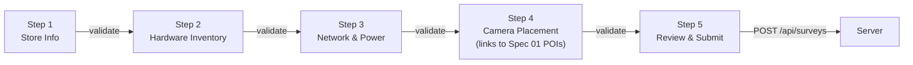
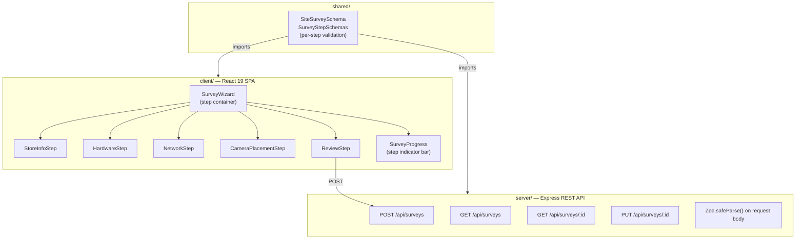
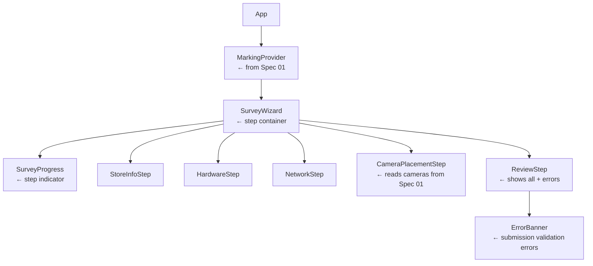

# Spec 02: Site Survey Checklist

> **Status:** Draft → Ready for Implementation  
> **Author:** Engineering Lead / Architect  
> **Last Updated:** 2026-03-25  
> **Depends On:** Spec 01 (Login, Camera Discovery, POI Marking)

---

## 📝 Context

After an installer logs in and marks detection points (Spec 01), they must complete a **Site Survey** — a structured checklist that captures all required metadata about the physical installation site. Without this data, the back-office team cannot validate the install or configure the Vision AI system remotely.

Today, installers use paper forms or free-text notes, leading to **missing fields, inconsistent data, and repeat site visits**. This feature replaces that with a guided, step-by-step digital checklist enforced by validation.

## 👤 User Story

**As an** Installer,  
**I want to** follow a guided, step-by-step checklist for the site survey,  
**So that** I don't miss any required information during the visit.

### Acceptance Criteria

| # | Criteria | Verification |
|---|----------|-------------|
| AC-1 | Checklist displays as a multi-step wizard with clear progress indication | Visual + unit test |
| AC-2 | Each step validates its fields before allowing navigation to the next step | Unit test |
| AC-3 | Installer cannot submit a survey with any required field missing | Unit test + API test |
| AC-4 | Submission with missing fields shows specific error messages per field | Unit test |
| AC-5 | Completed steps show a green checkmark; incomplete steps show a warning icon | Visual + unit test |
| AC-6 | Survey data persists in LocalStorage so progress survives page refresh | Unit test |
| AC-7 | Submitted survey is validated server-side with the same Zod schema | API test |
| AC-8 | All interactive elements have a minimum 48x48px hit target | Visual |
| AC-9 | Survey can be saved as draft (partial) and resumed later | Unit test |

---

## 🏗️ Architecture & Design Patterns

### Pattern: Wizard with Step Validation



### Component Architecture



### Design Patterns Used

| Pattern | Where | Why |
|---------|-------|-----|
| **Wizard Pattern** | `SurveyWizard` | Breaks complex form into digestible steps; prevents installers from being overwhelmed |
| **Step Validation** | Per-step Zod schemas | Users get immediate feedback at each step, not a giant error dump at the end |
| **Draft Persistence** | `LocalStorage` | Field work has unreliable connectivity; progress must survive app restarts |
| **Shared Validation** | Zod in `shared/` | Same schema validates on client (early feedback) and server (enforcement) |
| **Composite Schema** | `SiteSurveySchema` merges step schemas | Each step has its own schema; the full survey is a composition of all steps |

---

## 📐 Data Schemas (Shared — `shared/src/schemas.ts`)

### Step 1: Store Information

```typescript
export const SurveyStoreInfoSchema = z.object({
  storeId: z.string().regex(/^[A-Z]{2}-\d{3}$/, "Store ID must follow pattern AA-000"),
  storeName: z.string().min(2, "Store name is required"),
  storeAddress: z.string().min(5, "Full address is required"),
  storeType: z.enum(["Drive-Thru", "Dine-In", "Dual-Lane", "Walk-Up"]),
  contactName: z.string().min(2, "Contact name is required"),
  contactPhone: z.string().regex(/^\+?[\d\s\-()]{7,15}$/, "Valid phone number is required"),
});

export type SurveyStoreInfo = z.infer<typeof SurveyStoreInfoSchema>;
```

### Step 2: Hardware Inventory

```typescript
export const SurveyHardwareSchema = z.object({
  cameraCount: z.number().int().min(1, "At least 1 camera required").max(16),
  cameraModel: z.string().min(1, "Camera model is required"),
  mountType: z.enum(["Ceiling", "Wall", "Pole", "Gooseneck"]),
  processingUnitModel: z.string().min(1, "Processing unit model is required"),
  processingUnitSerial: z.string().min(5, "Serial number is required"),
  firmwareVersion: z.string().min(1, "Firmware version is required"),
});

export type SurveyHardware = z.infer<typeof SurveyHardwareSchema>;
```

### Step 3: Network & Power

```typescript
export const SurveyNetworkSchema = z.object({
  connectionType: z.enum(["Ethernet", "Wi-Fi", "Cellular"]),
  networkSsid: z.string().optional(),
  ipAssignment: z.enum(["DHCP", "Static"]),
  staticIp: z.string().optional(),
  internetSpeed: z.string().min(1, "Internet speed is required (e.g. '50 Mbps')"),
  powerSource: z.enum(["PoE", "AC-Adapter", "UPS-Backed"]),
  upsAvailable: z.boolean(),
});

export type SurveyNetwork = z.infer<typeof SurveyNetworkSchema>;
```

### Step 4: Camera Placement Summary

```typescript
export const SurveyCameraPlacementSchema = z.object({
  cameraId: z.string().uuid(),
  cameraName: z.string().min(1, "Camera name is required"),
  mountHeight: z.number().min(1, "Mount height must be at least 1 ft").max(30, "Mount height cannot exceed 30 ft"),
  angle: z.enum(["Overhead", "Side-View", "Angled-Down"]),
  fieldOfView: z.enum(["Narrow", "Standard", "Wide"]),
  poiCount: z.number().int().min(0),
  notes: z.string().optional(),
});

export type SurveyCameraPlacement = z.infer<typeof SurveyCameraPlacementSchema>;

export const SurveyCameraPlacementsSchema = z.array(SurveyCameraPlacementSchema)
  .min(1, "At least one camera placement is required");
```

### Step 5: Full Site Survey (Composite)

```typescript
export const SiteSurveySchema = z.object({
  id: z.string().uuid(),
  installerId: z.string().min(5),
  status: z.enum(["draft", "submitted", "approved", "rejected"]),
  createdAt: z.string().datetime(),
  updatedAt: z.string().datetime(),
  submittedAt: z.string().datetime().optional(),
  storeInfo: SurveyStoreInfoSchema,
  hardware: SurveyHardwareSchema,
  network: SurveyNetworkSchema,
  camerasPlacements: SurveyCameraPlacementsSchema,
});

export type SiteSurvey = z.infer<typeof SiteSurveySchema>;
```

### Validation Rules Summary

| Field | Rule | Error Message |
|-------|------|---------------|
| `storeId` | Regex `^[A-Z]{2}-\d{3}$` | "Store ID must follow pattern AA-000" |
| `storeName` | Min length 2 | "Store name is required" |
| `storeAddress` | Min length 5 | "Full address is required" |
| `storeType` | Enum | Must be one of the allowed types |
| `contactName` | Min length 2 | "Contact name is required" |
| `contactPhone` | Regex phone | "Valid phone number is required" |
| `cameraCount` | Int, 1–16 | "At least 1 camera required" |
| `cameraModel` | Min length 1 | "Camera model is required" |
| `mountType` | Enum | Must be one of the allowed types |
| `processingUnitSerial` | Min length 5 | "Serial number is required" |
| `connectionType` | Enum | Must be one of the allowed types |
| `internetSpeed` | Min length 1 | "Internet speed is required" |
| `mountHeight` | Float, 1–30 | "Mount height must be at least 1 ft" |
| `camerasPlacements` | Array, min 1 | "At least one camera placement is required" |
| All required fields | Non-empty | Specific per-field error message |

---

## 🛠️ Functional Requirements

### FR-1: Survey Wizard Container

**Component:** `client/src/components/survey/SurveyWizard.tsx`

The main container that manages step navigation and renders the active step.

**Behavior:**
- Displays the current step component and a progress indicator
- "Next" button validates the current step using the step's Zod schema before advancing
- "Back" button navigates to the previous step without validation
- "Save Draft" button saves the current partial survey to LocalStorage and the server (PUT)
- Step navigation is sequential — no skipping ahead to unvisited steps
- Previously completed steps can be revisited by tapping the progress indicator

**Props/State:**

```typescript
interface WizardState {
  currentStep: number;           // 0-indexed
  totalSteps: number;            // 5
  completedSteps: Set<number>;   // Steps that passed validation
  surveyData: Partial<SiteSurvey>;
  isDraft: boolean;
}
```

---

### FR-2: Survey Progress Indicator

**Component:** `client/src/components/survey/SurveyProgress.tsx`

A horizontal step indicator bar at the top of the wizard.

**Design Requirements:**
- Each step is a numbered circle (1–5) connected by a line
- Active step: `#39FF14` (Neon Green) fill
- Completed step: `#39FF14` fill with `Check` icon (Lucide)
- Incomplete step: `#6B7280` (Gray) fill
- Invalid/missing step on submit attempt: `#FF0000` (Safety Red) fill with `AlertTriangle` icon
- Step labels below circles: "Store", "Hardware", "Network", "Cameras", "Review"
- Minimum 48px tap target per step circle for glove-friendly interaction

```typescript
interface SurveyProgressProps {
  currentStep: number;
  completedSteps: Set<number>;
  invalidSteps: Set<number>;
  stepLabels: string[];
  onStepClick: (step: number) => void;
}
```

---

### FR-3: Store Info Step

**Component:** `client/src/components/survey/StoreInfoStep.tsx`

| Field | Input Type | Placeholder | Validation |
|-------|-----------|-------------|------------|
| Store ID | Text | `"AA-000"` | `SurveyStoreInfoSchema.storeId` |
| Store Name | Text | `"Main St Drive-Thru"` | Min 2 chars |
| Store Address | Textarea | `"123 Main St, City, ST 00000"` | Min 5 chars |
| Store Type | Select | — | Enum: Drive-Thru, Dine-In, Dual-Lane, Walk-Up |
| Contact Name | Text | `"John Smith"` | Min 2 chars |
| Contact Phone | Tel | `"+1 555-123-4567"` | Regex phone |

**Behavior:**
- On "Next" → validate with `SurveyStoreInfoSchema.safeParse()`
- Invalid fields show inline red error text below the field
- Valid fields show a subtle green border

---

### FR-4: Hardware Inventory Step

**Component:** `client/src/components/survey/HardwareStep.tsx`

| Field | Input Type | Placeholder | Validation |
|-------|-----------|-------------|------------|
| Camera Count | Number | `"1"` | Int, 1–16 |
| Camera Model | Text | `"VisionAI Cam Pro"` | Min 1 char |
| Mount Type | Select | — | Enum: Ceiling, Wall, Pole, Gooseneck |
| Processing Unit Model | Text | `"VisionAI Edge 200"` | Min 1 char |
| Processing Unit Serial | Text | `"SN-12345-ABCDE"` | Min 5 chars |
| Firmware Version | Text | `"v2.4.1"` | Min 1 char |

---

### FR-5: Network & Power Step

**Component:** `client/src/components/survey/NetworkStep.tsx`

| Field | Input Type | Placeholder | Validation |
|-------|-----------|-------------|------------|
| Connection Type | Select | — | Enum: Ethernet, Wi-Fi, Cellular |
| Network SSID | Text | `"StoreWiFi-5G"` | Optional (shown only if Wi-Fi) |
| IP Assignment | Select | — | Enum: DHCP, Static |
| Static IP | Text | `"192.168.1.100"` | Optional (shown only if Static) |
| Internet Speed | Text | `"50 Mbps"` | Min 1 char |
| Power Source | Select | — | Enum: PoE, AC-Adapter, UPS-Backed |
| UPS Available | Toggle | — | Boolean |

**Conditional Fields:**
- `networkSsid` visible only when `connectionType === "Wi-Fi"`
- `staticIp` visible only when `ipAssignment === "Static"`

---

### FR-6: Camera Placement Step

**Component:** `client/src/components/survey/CameraPlacementStep.tsx`

This step links to the camera data from Spec 01. For each detected camera, the installer fills in placement details.

| Field | Input Type | Placeholder | Validation |
|-------|-----------|-------------|------------|
| Camera Name | Text (pre-filled from Spec 01) | — | Min 1 char |
| Mount Height (ft) | Number | `"10"` | 1–30 |
| Angle | Select | — | Enum: Overhead, Side-View, Angled-Down |
| Field of View | Select | — | Enum: Narrow, Standard, Wide |
| POI Count | Number (auto-filled from Spec 01) | — | Int ≥ 0 |
| Notes | Textarea | `"Positioned above order board"` | Optional |

**Behavior:**
- Renders one card per camera from the MarkingContext `cameras` list
- POI count is auto-calculated from POIs marked in Spec 01 for that camera
- At least one camera placement entry is required to proceed

---

### FR-7: Review & Submit Step

**Component:** `client/src/components/survey/ReviewStep.tsx`

Displays a read-only summary of all steps for the installer to verify before submission.

**Layout:**
- Each step rendered as a collapsible section with an "Edit" button
- "Edit" navigates back to that specific step
- Missing/invalid fields highlighted in `#FF0000` (Safety Red)
- "Submit Survey" button at the bottom — disabled unless all steps are valid

**Submission Error Handling:**
- If any required field is missing → show a **red error banner** at the top:
  > "Survey incomplete — please fill in all required fields before submitting."
- Below the banner, list each missing field with its step name:
  > "Step 1 — Store Info: Store Address is required"  
  > "Step 3 — Network: Internet Speed is required"
- Scroll to and highlight the first incomplete step
- The invalid steps light up red in the progress indicator (FR-2)

---

### FR-8: Survey State Management

**Hook:** `client/src/hooks/useSurveyWizard.ts`

```typescript
interface UseSurveyWizard {
  // State
  currentStep: number;
  surveyData: Partial<SiteSurvey>;
  completedSteps: Set<number>;
  invalidSteps: Set<number>;
  errors: Record<string, string>;
  isDraft: boolean;
  isSubmitting: boolean;

  // Actions
  goToStep: (step: number) => void;
  nextStep: () => boolean;        // returns false if validation fails
  prevStep: () => void;
  updateStepData: (step: number, data: Record<string, unknown>) => void;
  validateStep: (step: number) => boolean;
  validateAll: () => { valid: boolean; errors: SurveyValidationError[] };
  saveDraft: () => Promise<void>;
  submitSurvey: () => Promise<boolean>;
}

interface SurveyValidationError {
  step: number;
  stepLabel: string;
  field: string;
  message: string;
}
```

**LocalStorage Key:** `vision-ai-survey-draft`

**Persistence Rules:**
- Auto-save to LocalStorage on every field change (debounced 500ms)
- On app load, hydrate from LocalStorage if a draft exists
- On successful submission, clear the draft from LocalStorage

---

## 🔌 API Contract (Server — `server/src/routes/`)

### POST `/api/surveys`

Submit a completed site survey. **Auth required.**

| | Detail |
|---|---|
| **Request Body** | `SiteSurvey` (validated by `SiteSurveySchema.safeParse()`) |
| **Success** | `201 Created` — returns the saved survey with status `"submitted"` |
| **Validation Error** | `400 Bad Request` — returns per-field errors |

**Validation Error Response Format:**

```json
{
  "error": "VALIDATION_ERROR",
  "message": "Survey is missing required fields",
  "statusCode": 400,
  "fieldErrors": [
    { "step": 0, "stepLabel": "Store Info", "field": "storeAddress", "message": "Full address is required" },
    { "step": 2, "stepLabel": "Network", "field": "internetSpeed", "message": "Internet speed is required" }
  ]
}
```

### PUT `/api/surveys/:id`

Save a draft survey (partial data allowed). **Auth required.**

| | Detail |
|---|---|
| **Request Body** | `Partial<SiteSurvey>` (relaxed validation — only validate fields that are present) |
| **Success** | `200 OK` — returns the saved draft |
| **Not Found** | `404 Not Found` |

### GET `/api/surveys`

List all surveys for the authenticated installer. **Auth required.**

| | Detail |
|---|---|
| **Success** | `200 OK` — `SiteSurvey[]` |

### GET `/api/surveys/:id`

Get a single survey by ID. **Auth required.**

| | Detail |
|---|---|
| **Success** | `200 OK` — `SiteSurvey` |
| **Not Found** | `404 Not Found` |

---

## 🧩 Component Tree



---

## 📁 File Structure (Expected Output)

```
client/src/
├── components/
│   └── survey/
│       ├── SurveyWizard.tsx        ← FR-1 (step container)
│       ├── SurveyProgress.tsx      ← FR-2 (progress indicator)
│       ├── StoreInfoStep.tsx       ← FR-3
│       ├── HardwareStep.tsx        ← FR-4
│       ├── NetworkStep.tsx         ← FR-5
│       ├── CameraPlacementStep.tsx ← FR-6
│       ├── ReviewStep.tsx          ← FR-7 (review + error display)
│       └── ErrorBanner.tsx         ← Submission error list
├── hooks/
│   └── useSurveyWizard.ts         ← FR-8 (wizard state + validation)
└── ...existing Spec 01 files...

server/src/
├── routes/
│   ├── surveys.ts                  ← POST/GET/PUT /api/surveys
│   └── ...existing Spec 01 files...
└── ...

shared/src/
├── schemas.ts                      ← Add survey schemas
└── index.ts                        ← Re-export new schemas
```

---

## 🧪 Test Specifications

### Testing Stack
- **Client:** Vitest + React Testing Library + jsdom
- **Server:** Vitest + Supertest
- **Shared:** Vitest (pure schema tests)

---

### Test Suite 1: Survey Schema Validation (`shared/src/__tests__/survey-schemas.test.ts`)

| # | Test Case | Expected |
|---|-----------|----------|
| SS-1 | Valid SurveyStoreInfo passes | Parse succeeds |
| SS-2 | Invalid storeId pattern rejects | ZodError: "must follow pattern AA-000" |
| SS-3 | Empty storeName rejects | ZodError: "Store name is required" |
| SS-4 | Invalid contactPhone rejects | ZodError: "Valid phone number is required" |
| SS-5 | Valid SurveyHardware passes | Parse succeeds |
| SS-6 | Camera count 0 rejects | ZodError: "At least 1 camera required" |
| SS-7 | Camera count 17 rejects | ZodError |
| SS-8 | Empty processingUnitSerial rejects | ZodError: "Serial number is required" |
| SS-9 | Valid SurveyNetwork passes | Parse succeeds |
| SS-10 | Empty internetSpeed rejects | ZodError: "Internet speed is required" |
| SS-11 | Valid SurveyCameraPlacement passes | Parse succeeds |
| SS-12 | Mount height 0 rejects | ZodError: "must be at least 1 ft" |
| SS-13 | Mount height 31 rejects | ZodError: "cannot exceed 30 ft" |
| SS-14 | Empty camerasPlacements array rejects | ZodError: "At least one camera placement" |
| SS-15 | Valid full SiteSurvey passes | Parse succeeds |
| SS-16 | SiteSurvey missing storeInfo rejects | ZodError |

---

### Test Suite 2: Survey Wizard Hook (`client/src/hooks/__tests__/useSurveyWizard.test.ts`)

| # | Test Case | Expected |
|---|-----------|----------|
| SW-1 | Initial state starts at step 0 | `currentStep === 0` |
| SW-2 | nextStep advances when step is valid | `currentStep === 1` |
| SW-3 | nextStep blocks when step is invalid | `currentStep === 0`, errors populated |
| SW-4 | prevStep goes back | `currentStep === 0` (from 1) |
| SW-5 | validateAll returns all errors | Array of SurveyValidationError |
| SW-6 | Draft saves to LocalStorage | `localStorage.getItem` returns data |
| SW-7 | Hydrates from LocalStorage on init | Fields populated from saved draft |

---

### Test Suite 3: StoreInfoStep Component (`client/src/components/survey/__tests__/StoreInfoStep.test.tsx`)

| # | Test Case | Expected |
|---|-----------|----------|
| SI-1 | Renders all 6 fields | All inputs visible |
| SI-2 | Invalid storeId shows inline error | Error text "must follow pattern" visible |
| SI-3 | Valid form passes validation | No error elements |
| SI-4 | All inputs meet 48px min height | Each `min-h-[48px]` class present |

---

### Test Suite 4: ReviewStep & Error Display (`client/src/components/survey/__tests__/ReviewStep.test.tsx`)

| # | Test Case | Expected |
|---|-----------|----------|
| RS-1 | Renders summary of all steps | Section headings visible for each step |
| RS-2 | Missing fields show red highlight | Error elements present for missing data |
| RS-3 | Submit button disabled when incomplete | Button has `disabled` attribute |
| RS-4 | Error banner lists all missing fields | Error messages with step names visible |
| RS-5 | Edit button navigates to the correct step | `onStepClick` called with correct index |

---

### Test Suite 5: Survey API Routes (`server/src/routes/__tests__/surveys.test.ts`)

| # | Test Case | Expected |
|---|-----------|----------|
| SA-1 | Submit valid survey returns 201 | `201` + survey object with status "submitted" |
| SA-2 | Submit incomplete survey returns 400 with field errors | `400` + `fieldErrors` array |
| SA-3 | Submit without auth returns 401 | `401` |
| SA-4 | Save draft returns 200 | `200` + survey with status "draft" |
| SA-5 | Get survey by ID returns 200 | `200` + survey object |
| SA-6 | Get nonexistent survey returns 404 | `404` |
| SA-7 | List surveys returns array | `200` + SiteSurvey[] |

---

## 🎨 UX Constraints (Mobile-First Field UX)

| Constraint | Rule | Rationale |
|------------|------|-----------|
| Min hit target | `48x48px` (progress dots: `48px`) | Installers wear gloves |
| Progress indicator | Fixed at top of wizard | Always visible, even with scrolling |
| Error color | `#FF0000` (Safety Red) | High contrast for error states |
| Success color | `#39FF14` (Neon Green) | Consistent with Spec 01 active states |
| Draft indicator | Blue badge "DRAFT" in header | Installer knows survey isn't submitted yet |
| Font size | Min `16px` body, `14px` labels | Readable at arm's length |
| Layout | Single column, no horizontal scrolling | One-handed mobile operation |
| Step transitions | Smooth vertical slide animation | Clear visual cue that the step changed |

---

## ⚠️ Error Handling Matrix

| Scenario | Client Behavior | Server Response |
|----------|----------------|-----------------|
| Required field missing on "Next" | Inline red error below field; step stays | N/A (client-only) |
| Submit with missing fields | Error banner + red progress dots + field list | `400 { fieldErrors: [...] }` |
| Server validation mismatch | Map `fieldErrors` to step/field highlights | `400 { error: "VALIDATION_ERROR" }` |
| Server unreachable on submit | Orange "Offline" toast + save as draft in LocalStorage | N/A |
| Server unreachable on save draft | Save to LocalStorage only; sync later | N/A |
| Survey already submitted | Show read-only view; disable "Submit" | `409 Conflict` |

---

## 📋 Implementation Checklist

- [ ] **Shared:** Add survey schemas (SurveyStoreInfo, SurveyHardware, SurveyNetwork, SurveyCameraPlacement, SiteSurvey)
- [ ] **Shared:** Export new schemas and types from `index.ts`
- [ ] **Server:** Create `surveys.ts` route (POST, GET, PUT)
- [ ] **Server:** Add auth middleware to survey routes
- [ ] **Server:** Return structured `fieldErrors` on validation failure
- [ ] **Client:** Create `SurveyWizard.tsx` (FR-1)
- [ ] **Client:** Create `SurveyProgress.tsx` (FR-2)
- [ ] **Client:** Create `StoreInfoStep.tsx` (FR-3)
- [ ] **Client:** Create `HardwareStep.tsx` (FR-4)
- [ ] **Client:** Create `NetworkStep.tsx` (FR-5)
- [ ] **Client:** Create `CameraPlacementStep.tsx` (FR-6)
- [ ] **Client:** Create `ReviewStep.tsx` + `ErrorBanner.tsx` (FR-7)
- [ ] **Client:** Create `useSurveyWizard.ts` hook (FR-8)
- [ ] **Client:** Wire survey into `App.tsx` (after camera marking flow)
- [ ] **Tests:** All 5 test suites pass
- [ ] **All:** `npm run build` — zero errors
- [ ] **All:** `npm run test` — all tests pass

---

## 🚀 Execution Prompts

### Step 1 — Shared Schemas + Tests
```
Execute spec 02 — shared survey schemas + test Suite 1
```

### Step 2 — Wizard Hook + Tests
```
Execute spec 02 — useSurveyWizard hook (FR-8) + test Suite 2
```

### Step 3 — Step Components
```
Execute spec 02 — FR-1 through FR-7 (SurveyWizard, Progress, all step components, ReviewStep, ErrorBanner) + test Suites 3 and 4
```

### Step 4 — Server Routes + Tests
```
Execute spec 02 — server surveys route + test Suite 5
```

### Step 5 — Wire Up + Verify
```
Execute spec 02 — wire into App.tsx, verify npm run build and npm run test pass
```

### Full Execution
```
Execute spec 02 — full implementation following the Implementation Checklist
```
